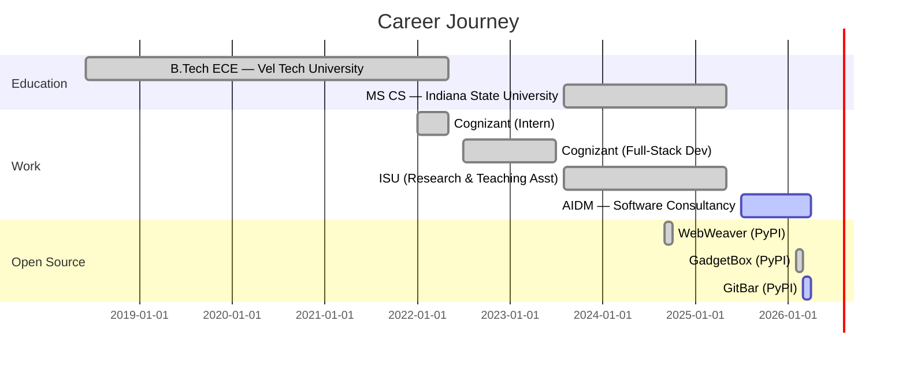

<!-- Animated gradient header wave -->


<!-- Animated typing SVG -->
<div align="center">

<a href="https://git.io/typing-svg"></a>

<br/>

<!-- Animated social badges with hover effect -->
[](https://www.linkedin.com/in/vamsikollipara/)
[](https://vamsikrishnakollipara.vercel.app/)
[](https://pypi.org/user/vamsi876/)
[](mailto:kolliparavamsikrishna80@gmail.com)

<br/>

<!-- Animated profile views + followers -->

<a href="https://github.com/vamsi876?tab=followers"></a>

</div>

---

<!-- Animated snake contribution graph -->
<div align="center">
  <picture>
    <source media="(prefers-color-scheme: dark)" srcset="https://raw.githubusercontent.com/platane/snk/output/github-contribution-grid-snake-dark.svg" />
    <source media="(prefers-color-scheme: light)" srcset="https://raw.githubusercontent.com/platane/snk/output/github-contribution-grid-snake.svg" />
    
  </picture>
</div>

---

##  About Me


```typescript
const vamsi = {
    pronouns: "he" | "him",
    role: "Full-Stack Developer",
    company: "AIDM — Software Consultancy",
    education: {
        masters: "MS in CS — Indiana State University",
        gpa: 3.66
    },

    building: [
        "Healthcare portals (Next.js + PostgreSQL)",
        "RAG pipelines (LangChain + Pinecone)",
        "HIPAA-compliant systems (Azure AD + SSO)"
    ],

    openSource: {
        gitbar:    "macOS menubar Git dashboard",
        gadgetbox: "12 dev utilities in a system tray",
        webweaver: "Async web crawling library"
    },

    funFact: "I automate everything — even my resume"
};
```

<br clear="right"/>

---

##  Tech Stack

<div align="center">

<!-- Animated skill icons using skillicons.dev -->
<p>
  <a href="https://skillicons.dev">
    
  </a>
</p>

<details>
<summary><b>Click to see detailed breakdown</b></summary>
<br/>

| Category | Technologies |
|:--------:|:------------|
| **Languages** |     |
| **Frontend** |    |
| **Backend** |    |
| **AI / LLM** |    |
| **Cloud** |     |

</details>

</div>

---

##  Featured Projects

<div align="center">
<table>
<tr>
<td width="50%" valign="top">

<h3 align="center"> GitBar</h3>
<p align="center">
  <b>macOS Menubar Git Dashboard</b>
</p>

<p align="center">
  <a href="https://pypi.org/project/gitbar/">
    
  </a>
  <a href="https://pypi.org/project/gitbar/">
    
  </a>
</p>

<p align="center">
  Unified menubar dashboard aggregating PRs, issues, CI/CD status & local repo health across <b>GitHub, GitLab & Bitbucket</b>
</p>

<p align="center">
  
  
  
</p>

<p align="center">
  <a href="https://github.com/vamsi876/gitbar"></a>
</p>

</td>
<td width="50%" valign="top">

<h3 align="center"> GadgetBox</h3>
<p align="center">
  <b>Cross-Platform Developer Utilities</b>
</p>

<p align="center">
  <a href="https://pypi.org/project/gadgetbox/">
    
  </a>
  <a href="https://pypi.org/project/gadgetbox/">
    
  </a>
</p>

<p align="center">
  System tray app with <b>12 developer utilities</b> — JSON formatter, JWT decoder, UUID generator, regex tester & more
</p>

<p align="center">
  
  
  
</p>

<p align="center">
  <a href="https://github.com/vamsi876/gadgetbox"></a>
</p>

</td>
</tr>
<tr>
<td width="50%" valign="top">

<h3 align="center"> WebWeaver</h3>
<p align="center">
  <b>Async Web Crawling Library</b>
</p>

<p align="center">
  <a href="https://pypi.org/project/WebWeaver/">
    
  </a>
  <a href="https://pypi.org/project/WebWeaver/">
    
  </a>
</p>

<p align="center">
  Configurable crawling with URL validation, deduplication & robots.txt compliance. Powers the <b>ISU RAG chatbot's 40K+ URL</b> knowledge base
</p>

<p align="center">
  
  
  
</p>

<p align="center">
  <a href="https://pypi.org/project/WebWeaver/"></a>
</p>

</td>
<td width="50%" valign="top">

<h3 align="center"> ISU RAG Chatbot</h3>
<p align="center">
  <b>University Q&A System</b>
</p>

<p align="center">
  <a href="https://github.com/vamsi876/ISU-End-to-End-Chatbot">
    
  </a>
  <a href="https://github.com/vamsi876/ISU-End-to-End-Chatbot">
    
  </a>
</p>

<p align="center">
  RAG chatbot answering student queries with semantic retrieval over <b>8,000 curated documents</b> from 40K+ crawled URLs
</p>

<p align="center">
  
  
  
</p>

<p align="center">
  <a href="https://github.com/vamsi876/ISU-End-to-End-Chatbot"></a>
</p>

</td>
</tr>
</table>
</div>

---

##  GitHub Analytics

<div align="center">

<!-- Stats cards with matching dark theme -->


<br/>

<!-- Streak stats -->


<br/>

<!-- Activity graph -->


</div>

---

##  Experience Timeline



---

<div align="center">

###  Let's Connect & Build Together

<br/>

<a href="https://www.linkedin.com/in/vamsikollipara/"></a>
<a href="mailto:kolliparavamsikrishna80@gmail.com"></a>
<a href="https://vamsikrishnakollipara.vercel.app/"></a>
<a href="https://pypi.org/user/vamsi876/"></a>

<br/><br/>

> *"The best way to predict the future is to build it."*

<br/>

<!-- Animated footer wave -->


</div>
