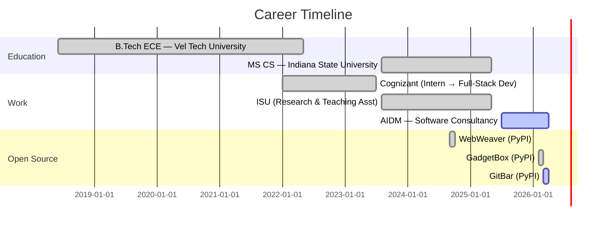

<!-- Animated gradient header -->


<!-- Animated typing SVG -->
<div align="center">

<a href="https://git.io/typing-svg"></a>

<br/><br/>

<!-- Social badges -->
<a href="https://www.linkedin.com/in/vamsikollipara/"></a>&nbsp;
<a href="https://vamsikrishnakollipara.vercel.app/"></a>&nbsp;
<a href="https://pypi.org/user/vamsi876/"></a>&nbsp;
<a href="mailto:kolliparavamsikrishna80@gmail.com"></a>

<br/><br/>

&nbsp;
<a href="https://github.com/vamsi876?tab=followers"></a>

</div>

---

<div align="center">

## `> whoami`

</div>


```typescript
const vamsi = {
    role: "Full-Stack Developer",
    company: "AIDM Software Consultancy",
    education: "MS in CS — Indiana State University (3.66 GPA)",

    currentlyBuilding: [
        "Healthcare portals (Next.js + PostgreSQL)",
        "RAG pipelines (LangChain + Pinecone)",
        "HIPAA-compliant systems (Azure AD + SSO)"
    ],

    openSource: {
        gitbar:    "macOS menubar Git dashboard",
        gadgetbox: "12 dev utilities in a system tray",
        webweaver: "Async web crawling library"
    },

    funFact: "I automate everything — even my resume 🤖"
};
```

<br clear="right"/>

---

<div align="center">

## ⚡ Tech Arsenal

<br/>

<a href="https://skillicons.dev">
  
</a>
<br/>
<a href="https://skillicons.dev">
  
</a>

<br/><br/>

<details>
<summary><b>📋 Detailed Breakdown</b></summary>
<br/>

| Category | Technologies |
|:--------:|:------------|
| **Languages** |     |
| **Frontend** |     |
| **Backend** |     |
| **AI / LLM** |     |
| **Cloud & DevOps** |     |
| **Databases** |     |

</details>

</div>

---

<div align="center">

## 🚀 Featured Projects

</div>

<div align="center">
<table>
<tr>
<td width="50%" valign="top">

<h3 align="center">🖥️ GitBar</h3>
<p align="center"><b>macOS Menubar Git Dashboard</b></p>

<p align="center">
  <a href="https://pypi.org/project/gitbar/"></a>
  <a href="https://pypi.org/project/gitbar/"></a>
</p>

<p align="center">Unified menubar dashboard aggregating PRs, issues, CI/CD status & repo health across <b>GitHub, GitLab & Bitbucket</b></p>

<p align="center">
  
  
  
</p>

<p align="center">
  <a href="https://github.com/vamsi876/gitbar"></a>
</p>

</td>
<td width="50%" valign="top">

<h3 align="center">🧰 GadgetBox</h3>
<p align="center"><b>Cross-Platform Developer Utilities</b></p>

<p align="center">
  <a href="https://pypi.org/project/gadgetbox/"></a>
  <a href="https://pypi.org/project/gadgetbox/"></a>
</p>

<p align="center">System tray app with <b>12 developer utilities</b> — JSON formatter, JWT decoder, UUID generator, regex tester & more</p>

<p align="center">
  
  
  
</p>

<p align="center">
  <a href="https://github.com/vamsi876/gadgetbox"></a>
</p>

</td>
</tr>
<tr>
<td width="50%" valign="top">

<h3 align="center">🕸️ WebWeaver</h3>
<p align="center"><b>Async Web Crawling Library</b></p>

<p align="center">
  <a href="https://pypi.org/project/WebWeaver/"></a>
  <a href="https://pypi.org/project/WebWeaver/"></a>
</p>

<p align="center">Configurable crawling with URL validation, deduplication & robots.txt compliance. Powers the <b>ISU RAG chatbot's 40K+ URL</b> knowledge base</p>

<p align="center">
  
  
  
</p>

<p align="center">
  <a href="https://pypi.org/project/WebWeaver/"></a>
</p>

</td>
<td width="50%" valign="top">

<h3 align="center">🤖 ISU RAG Chatbot</h3>
<p align="center"><b>University Q&A System</b></p>

<p align="center">
  <a href="https://github.com/vamsi876/ISU-End-to-End-Chatbot"></a>
  <a href="https://github.com/vamsi876/ISU-End-to-End-Chatbot"></a>
</p>

<p align="center">RAG chatbot answering student queries with semantic retrieval over <b>8,000 curated documents</b> from 40K+ crawled URLs</p>

<p align="center">
  
  
  
</p>

<p align="center">
  <a href="https://github.com/vamsi876/ISU-End-to-End-Chatbot"></a>
</p>

</td>
</tr>
</table>
</div>

---

<div align="center">

## 📊 GitHub Analytics

<br/>

<!-- Profile Summary Cards (reliable alternative) -->


<br/>

<!-- Streak stats -->


<br/>

<!-- Productive time + profile details -->


<br/>

<!-- Activity graph -->


</div>

---

<!-- Snake animation -->
<div align="center">
  <picture>
    <source media="(prefers-color-scheme: dark)" srcset="https://raw.githubusercontent.com/platane/snk/output/github-contribution-grid-snake-dark.svg" />
    <source media="(prefers-color-scheme: light)" srcset="https://raw.githubusercontent.com/platane/snk/output/github-contribution-grid-snake.svg" />
    
  </picture>
</div>

---

<div align="center">

## 🗺️ Career Journey

</div>



---

<div align="center">

### 🤝 Let's Connect & Build Together

<br/>

<a href="https://www.linkedin.com/in/vamsikollipara/"></a>&nbsp;
<a href="mailto:kolliparavamsikrishna80@gmail.com"></a>&nbsp;
<a href="https://vamsikrishnakollipara.vercel.app/"></a>&nbsp;
<a href="https://pypi.org/user/vamsi876/"></a>

<br/><br/>

> *"The best way to predict the future is to build it."*

<br/>


</div>
